# Screenshots

Screenshots are automatically updated when UI changes are pushed to main.

## Desktop

### Workspace Selector
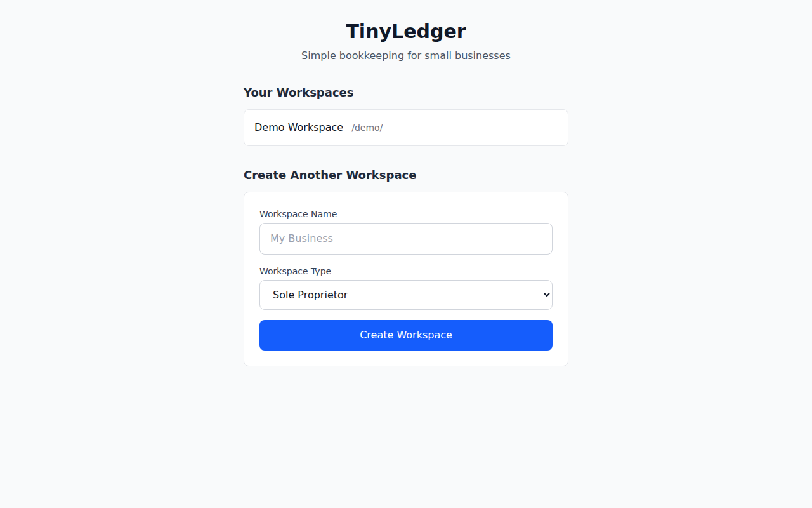

### Dashboard
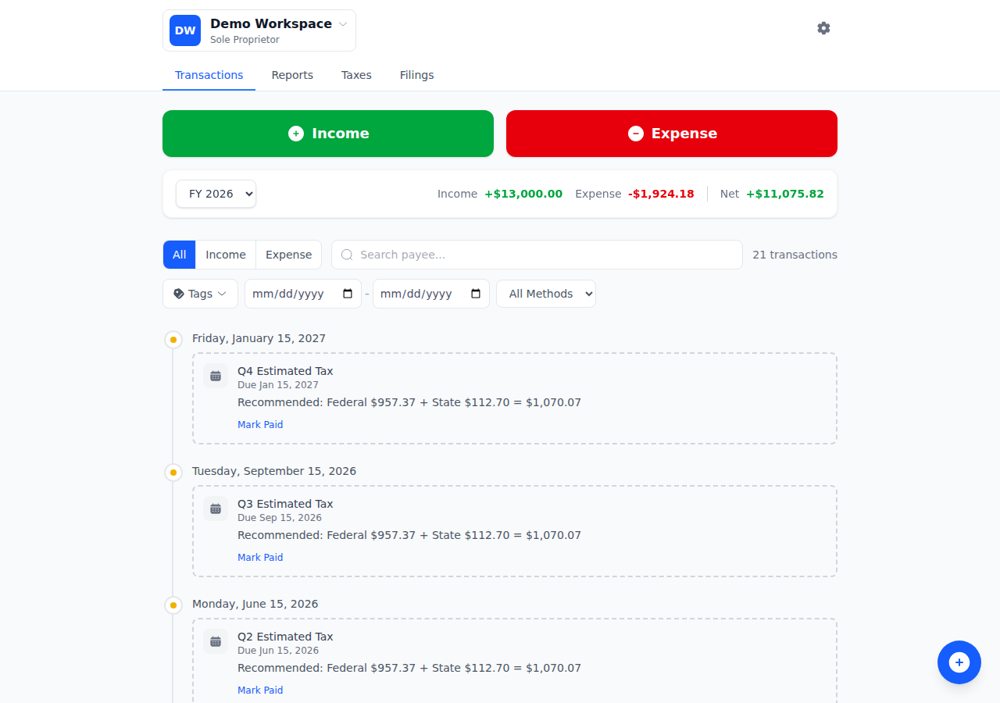

### Transactions
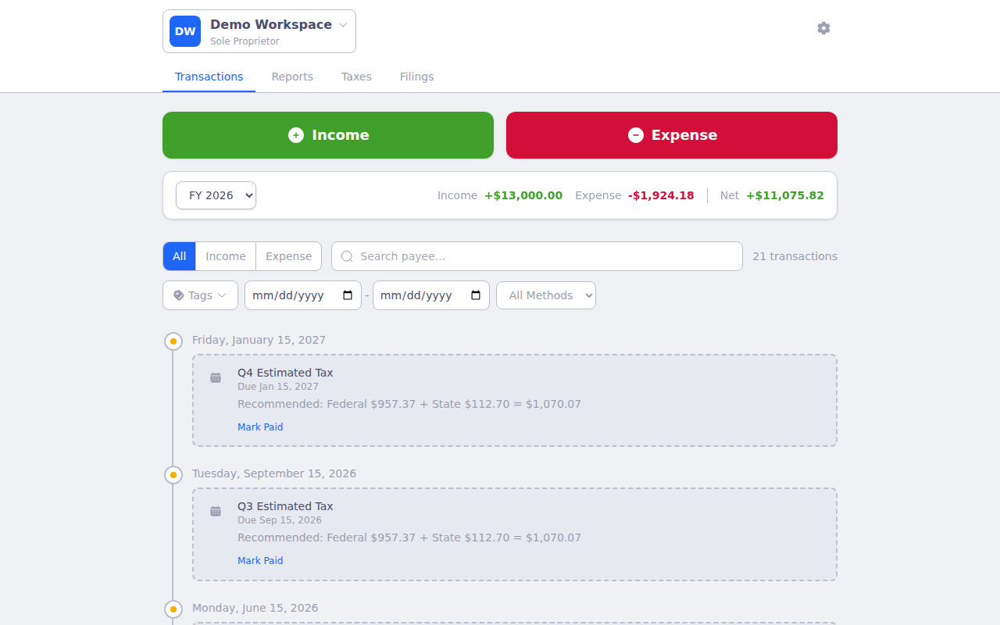

### New Transaction
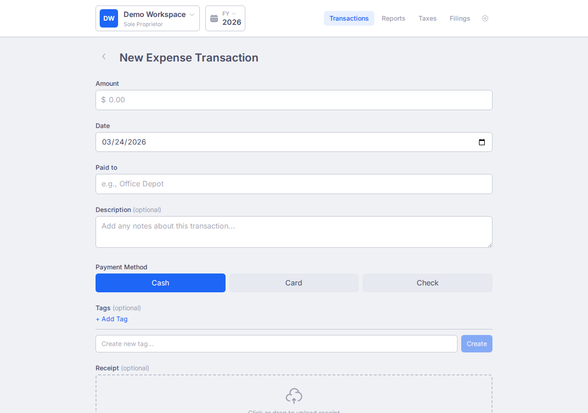

### Reports

### Taxes
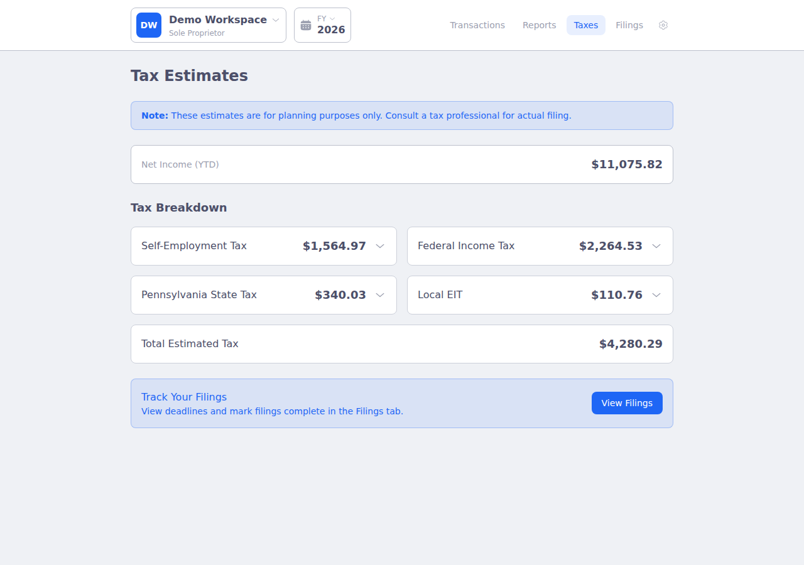

### Recurring Transactions
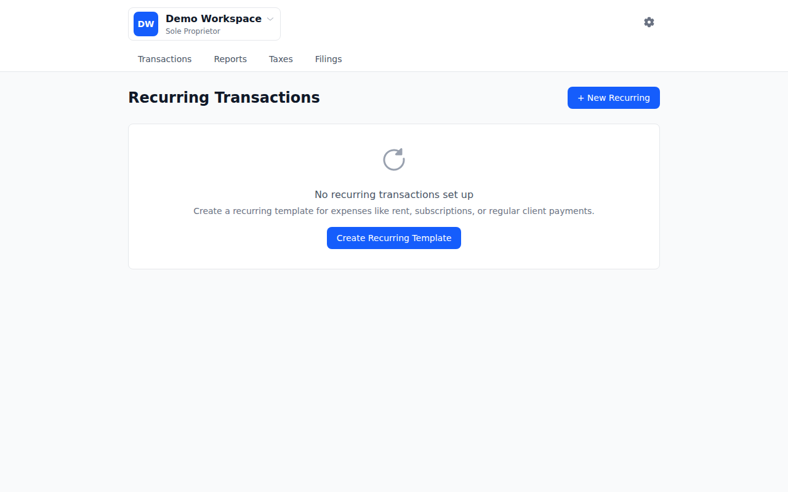

### Settings
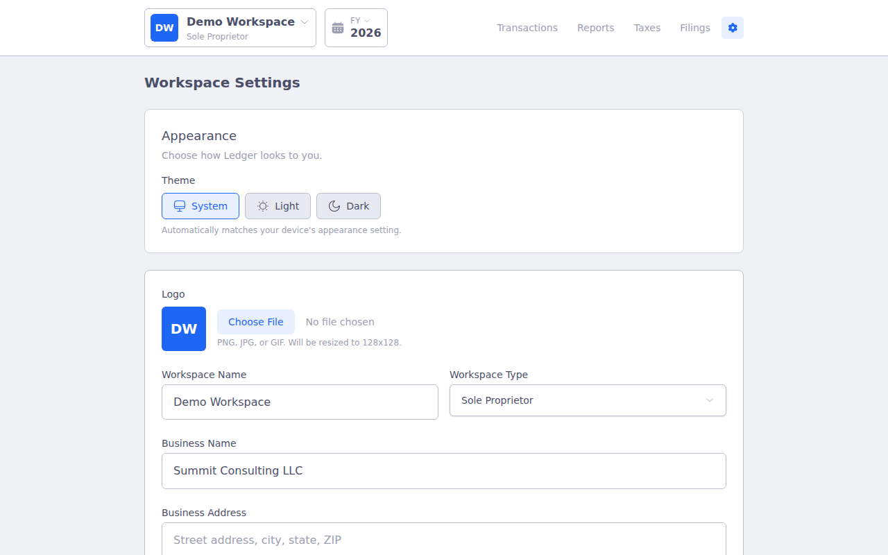

## Mobile

### Workspace Selector
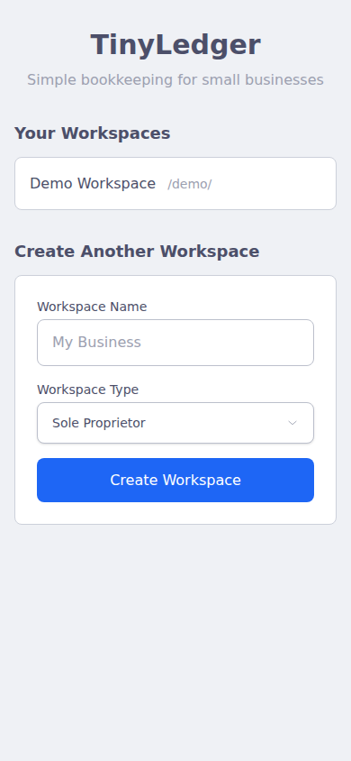

### Dashboard
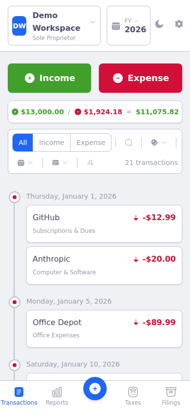

### Transactions
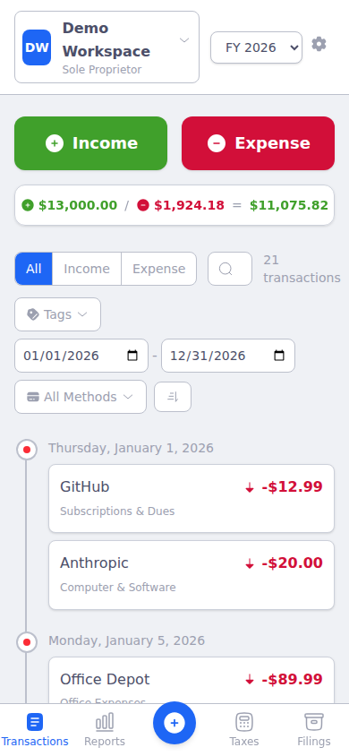

### New Transaction
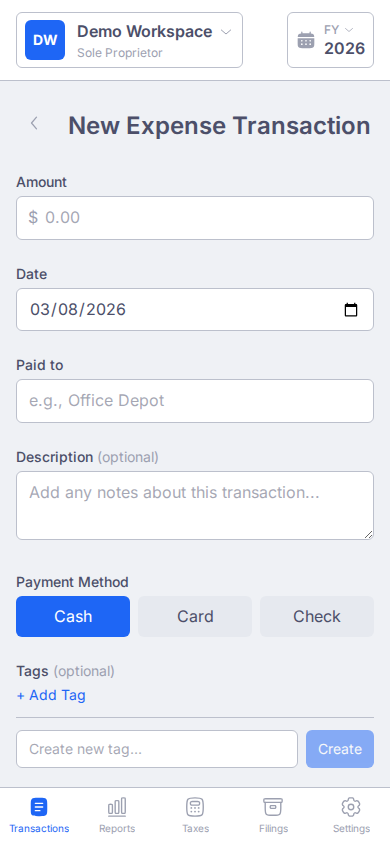

### Reports
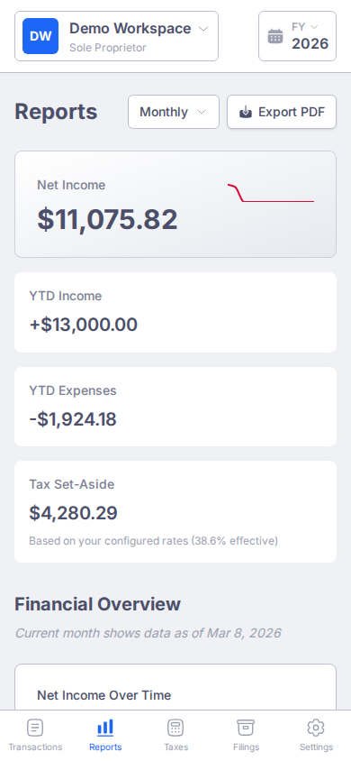
